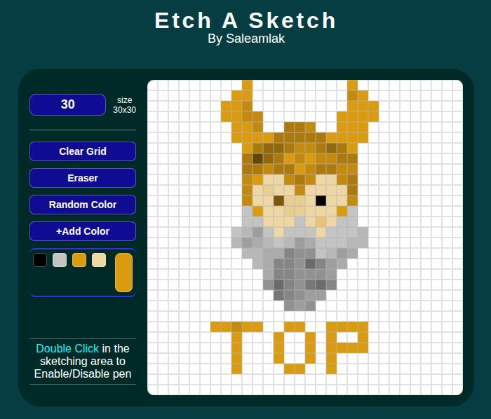

# Etch A Sketch

**Etch A Sketch** is a sketching tool that allows you to create art by coloring squares on a dynamic grid.

This project focus on **DOM manipulation** and **Flexbox implementation** as part of the Foundation course of [The Odin Project](https://www.theodinproject.com).

[**View Live Demo**](https://saleamlakh.github.io/etch-a-sketch)

## Features
- **Customizable Grid Size**: Generate grid of any size (default 16x16).
- **Add a color**: Add any color to sketch with.
- **Random color sketch**: Automatically generates a random color for every square the mouse touches.
- **Progressive Darkening**: A shading effect that increases the darkness of a cell by 10% with every interaction.
- **Eraser**: Selectively remove mistakes without clearing the whole board.
- **Clear Grid**: clear the entire area clean to start over.

## Things Good To Know (Bugs and challenges faced)

1. **Event Accumulation**: Make sure an event is not registered multiple times. 
    - **Issue**:I attached 'change' event listener to the 'color input' every time 'Add color' button was clicked. This cause 'event accumulation'. If the button clicked five times, a single color change triggers five separate functions. This adds the same color five times.
    - **Fix**: Ensure event listener is initialized only once or remove the event listener.

2. **Event Delegation**: Make sure the target is the right element. 
    - **Issue**: When an event attached to the parent/grid container, hovering over the edges of the containers colors the entire row or the container itself. This is because the entire 'target' is the container rather than the individual grid cell. 
    - **Fix**: Check the target is matches the grid cells. (in my case, i check if the cell has children. if not, it is a cell).

3. **Documentations of builtin methods/functions**: Try to read the documentations about builtin methods/functions that you use in the project. 

    - **Issue**: I used `parseInt(string)` to convert the user input into a number and  check if it is valid after that. However, it return a number if the string starts with a number but contains letters.
    - **Fix**: Use `Number(string)`. It returns `NAN` if all characters are not a number. But it returns `0` for empty string.

4. **Performance and DOM access**: Avoid accessing DOM element multiple times rather use a a variable. This tasks requires iterating the whole document until it gets the required element. So this will kill the performance of the program.

## Live Demo
[Etch A Sketch](https://saleamlakh.github.io/etch-a-sketch)